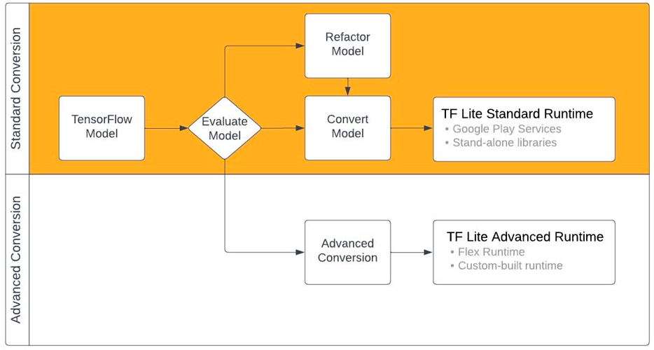
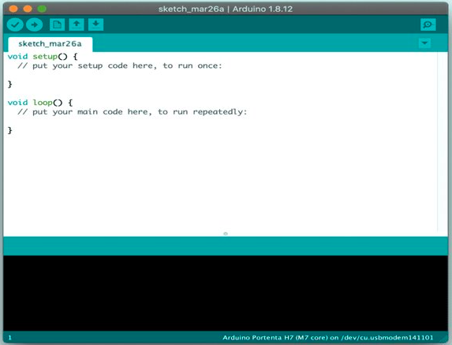
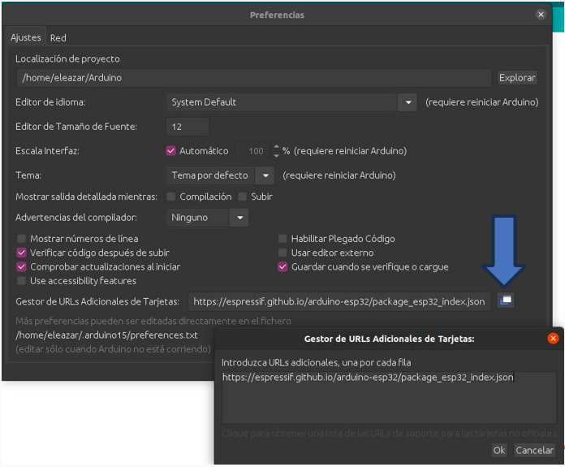
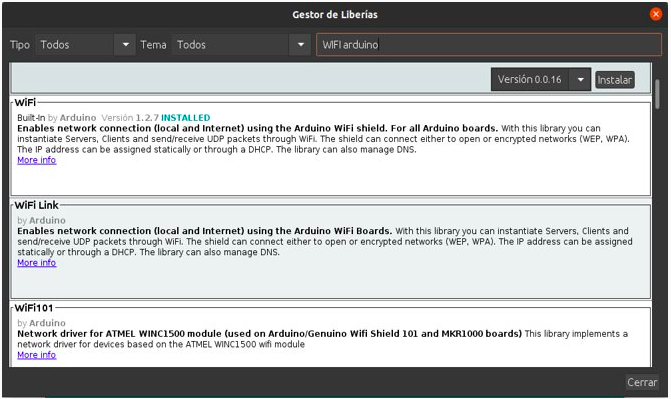
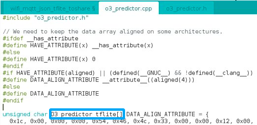

# AI REGIO 5.0 AI Reployment on Open Hardware Guide

## Python Models to C Code Demostration​

### TensorFlow Lite
#### Introduction

The process involves converting models created with TensorFlow Core to TensorFlow Lite models. The conversion workflow begins with evaluating the model's compatibility with TensorFlow Lite's runtime environments. If the model uses operations outside the compatible set, options include refactoring the model or using advanced conversion techniques.​



##### Model Conversion​

The TensorFlow Lite converter takes a TensorFlow model as input and generates a TensorFlow Lite model in the form of an optimized FlatBuffer file with a *.tflite* extension. ​

The converter provides flags or options for customizing the conversion process, such as enabling custom operators, specifying optimization techniques like post-training quantization, and adding metadata to the converted model.

##### Input formats

You can use the converter with the following input model formats:​

- SavedModel (recommended): A TensorFlow model saved as a set of files on disk.​

- Keras model: A model created using the high level Keras API.​

- Keras H5 format: A light-weight alternative to SavedModel format supported by Keras API.​

- Models built from concrete functions: A model created using the low level TensorFlow API.​


#### Model Generation​

The following call has been added to the Workflow function for model generation:​

```python
def workflow(short=False):​
    ···​

​
    converter = tf.lite.TFLiteConverter.from_keras_model(model)​
    tflite_model = converter.convert()​
​
    with open('./O3_predictor.tflite',​
              "wb") as f:​
        f.write(tflite_model)​
```

With this, we generate the code directly in .tflite format.​

**The full code can be found [here](./code/train_model.py)**

#### Keras To TFLite Model​

This unix command transforms the .tflite file to C​

```
xxd -i O3_predictor.tflite > o3_predictor.cpp
```

The output file will be similar to this one:​

```c
unsigned char converted_model_tflite[] = {​

  0x18, 0x00, 0x00, 0x00, 0x54, 0x46, 0x4c, 0x33, 0x00, 0x00, 0x0e, 0x00,​

  // <Lines omitted>​

};​

unsigned int converted_model_tflite_len = 18200;​
```

The full code can be found [here](./code/xxd_output.cpp): 

This file can be imported in Arduino IDE or similar software​

### Arduino IDE

#### Adapting the code to work in Arduino IDE

Once the AI model generated in the previous step has been obtained, it is necessary to carry out some previous steps to use the model within the IDE, these steps consist of modifying the content of the file containing the matrix generated by the "xxd" command to optimize its import into the Hardware.​

​The first thing will be to create an .h file that will contain the declaration of the two variables that are inside the C code, in addition to the typical guidelines of the C code files.​

Steps:​

1.  Create the .h called o3_predictor.h file and store the following:​

```
#ifndef TENSORFLOW_LITE_PREDICTOR_O3_H​
#define TENSORFLOW_LITE_PREDICTOR_O3_H​
​
extern unsigned char O3_predictor_tflite[];​
extern unsigned int O3_predictor_tflite_len;​
#endif​
```

The variable names can be modified, they are only used to match the example provided.​

2.  Edit the .cpp file generated from xdd command and add the next on top.​

```c
#include "o3_predictor.h"​
// We need to keep the data array aligned on some architectures.​

#ifdef __has_attribute​
#define HAVE_ATTRIBUTE(x) __has_attribute(x)​
#else​
#define HAVE_ATTRIBUTE(x) 0​
#endif​
#if HAVE_ATTRIBUTE(aligned) || (defined(__GNUC__) && !defined(__clang__))​
#define DATA_ALIGN_ATTRIBUTE __attribute__((aligned(4)))​
#else​
#define DATA_ALIGN_ATTRIBUTE​
#endif​
```

3.  Edit the variable names to match the .h file.

```c
unsigned char O3_predictor_tflite[] DATA_ALIGN_ATTRIBUTE = {​

  0x1c, 0x00, 0x00, 0x00, 0x54, 0x46, 0x4c, 0x33, 0x00, 0x00, 0x12, 0x00,​

 ···​

};​

unsigned int O3_predictor_tflite_len = 1140;​
```

The final file can be found [here](./code/o3_predictor.cpp)

#### Arduino IDE Project creation
Now in Arduino we click on File -> New​


##### New development boards installation​

Click on File -> Preferences and in the "Additional Card URLS Manager" section:​

Add the Espressif URL that includes the definition of the development boards.​

https://espressif.github.io/arduino-esp32/package_esp32_index.json​




##### Libraries Installation

click on Tools -> Library Management and there use the search bar to locate new libraries to install.​

​
Libraries example:​
· Wifi​
· Pubsubclient​
· TensorFlowLite_ESP32​



##### Workflow


The setup function is a good place to initialise the input and output parameters so that they are ready to be used. ​

The program then moves on to the code in the loop function. The program calls the code inside the loop function repeatedly until the Arduino board shuts down.
​
###### Variables initialization

```
// WIFI CONF​
//const char* ssid = "Wokwi-GUEST"; //uncomment and edit to your wifi​
//const char* password = "";​
WiFiClient espClient;​

// MQTT CONF​
const char* mqttServer = "broker.emqx.io";​
const char* mqttTopic = "topicName/aq";​
int port = 1883;​
String stMac;​
char mac[50];​
char clientId[50];​
PubSubClient client(espClient);​
···
```

###### Setup

```
void setup() {​

  Serial.begin(115200);​
  wifiConnect();  ​
  client.setServer(mqttServer, port);​
  client.setCallback(callback);​
  ···​
  error_reporter = &micro_error_reporter;​
  model = tflite::GetModel(O3_predictor_tflite);​
  static tflite::MicroMutableOpResolver<1> resolver;​
  static tflite::MicroInterpreter static_interpreter(​
    model, resolver, tensor_arena, kTensorArenaSize, error_reporter);​
  interpreter = &static_interpreter;​
  input = interpreter->input(0);​
  output = interpreter->output(0);​
  inference_count = 0;​
```

The **GetModel** function must be passed the name of the variable from the .cpp file obtained earlier that contains the C data matrix, as shown in the following image:



###### Loop

```
void loop() {​
  delay(10);​
  if (!client.connected()) {​
    mqttReconnect();​
  }​
  client.loop();​
}
```

###### MQTT Callback

```
void callback(char* topic, byte* message, unsigned int length) {​
    deserializeJson(doc, (const byte*)message, length); //parse input to doc​
    float values[] = {doc["PM10"], doc["PM2.5"], doc["NO2"], doc["SO2"], doc["O3"], doc["CO"]}; ​
    input->data.f[0] = values[0];​
    input->data.f[1] = values[1];​
    ···​
    Serial.println("Invoking Tensorflow Lite");​
    TfLiteStatus invoke_status = interpreter->Invoke();     ​
    char buffer[10];​
    sprintf(buffer, "{'o3':%.2f}",output->data.f[0]);​
    Serial.println(buffer);​
}
```

##### Testing the model
Press the arrow pointing to the right to compile the code and upload it to the physical board

###### Sending data to the board
The next command send the required data to the mqtt server to be received by the Open Hardware:

```bash
docker run -it --rm efrecon/mqtt-client pub -h broker.emqx.io -t "topicName/aq" -m \
'{"PM10":156.0, "PM2.5":137.0, "NO2":29.0,"SO2":17.0,"O3":5.0,"CO":1.1}'
```


